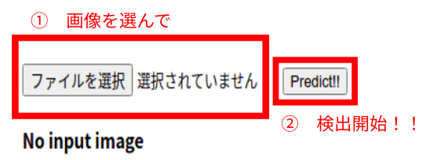
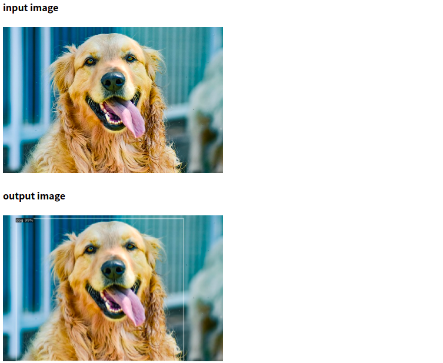

# Web-Image-Processing

Djangoの勉強のために作成したプロジェクトです。

## 概要

今は物体検出を行うことができます。

サーバー立ち上げ後、/predictionに移動することでアプリが立ち上がります。

検出モデルとしてはFaster R-CNNを使用しており、学習済みモデルを利用しています。



上記のような手順を踏むと、選んだ画像から物体を検出します。



## 環境設定

コマンドラインから以下を実行することで環境が整います。

```shell
pip3 install -r requirement.txt
```

## クローン後の操作

1. 環境を整えてください。

2. SECRET_KEYを書き加えてください。

## To Do

* herokuにデプロイしているが、処理に時間がかかり、タイムアウトとなってしまうため実行ができなくなっています。（ローカルでも25s近くかかっています）

* ページデザイン
* 他の画像処理機能など
  * main.pyには実装時に使用していたグレースケール処理も含まれています
  * 一般的な画像処理、cutmixなどのdata augmentationもボタン1つで実行できるように拡張する予定

